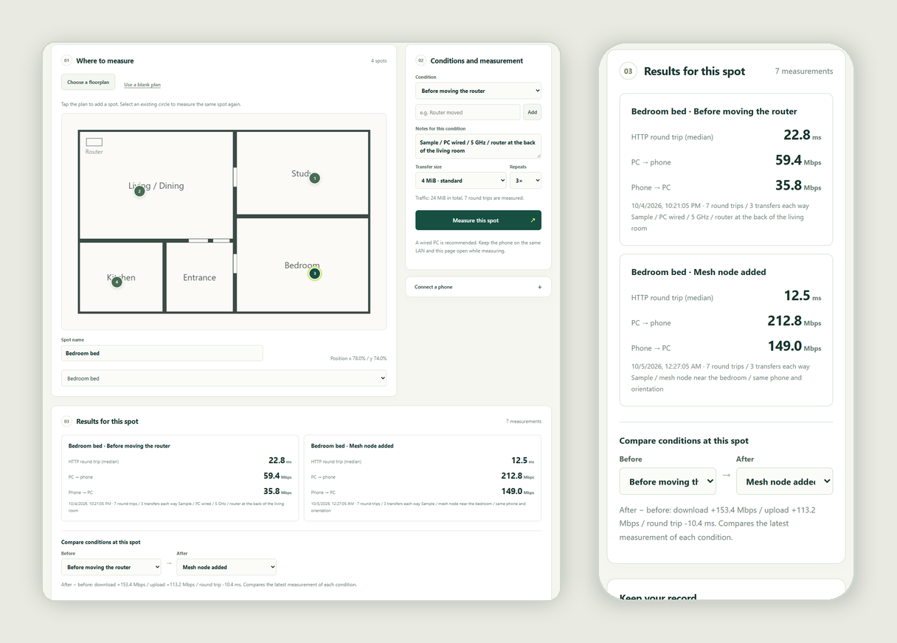

# RoomPing

[](https://github.com/anpanmanj987-hub/RoomPing/actions/workflows/ci.yml)
[](LICENSE)


**Compare your home network at the spots you actually measured.**

"Is the bedroom really slower?" "Did the mesh node actually help?" RoomPing answers these on your own floorplan. Start it on a PC, scan the QR code with your phone, walk around and tap where you are: it measures PC↔phone transfer speed and response time and pins the result to that spot. Measure the same spot again after changing something, such as moving the router, and see the difference right away.

[日本語 README](README.md)



<sub>The screenshot shows the bundled sample record [`docs/sample-roomping.en.json`](docs/sample-roomping.en.json); its values are illustrative, not measured.</sub>

## Features

- **Results pinned to places**: use your own floorplan image (PNG/JPEG/WebP) or a blank plan.
- **Before/after comparisons**: measure the same spot under named conditions such as "before moving the router" or "mesh node added" and see the download, upload and latency deltas.
- **Only what you measured**: no interpolated heatmaps of places you never visited.
- **No phone app**: everything runs in the phone's browser. The PC side depends only on `qrcode`.
- **English and Japanese**: the interface follows your browser language; switch any time with the button at the top right.
- **Your data stays with you**: floorplans and results live in the browser and are saved as JSON (CSV export too). Nothing is sent to external services.

## Quick start

Requires Python 3.10 or newer on Windows, macOS or Linux.

```sh
python -m venv roomping-env
# Windows: roomping-env\Scripts\activate   macOS/Linux: source roomping-env/bin/activate
python -m pip install https://github.com/anpanmanj987-hub/RoomPing/archive/refs/tags/v0.1.0a4.zip
python -m roomping --host 0.0.0.0 --advertise 192.168.1.20
```

Replace `192.168.1.20` with your PC's LAN IPv4 address (`ipconfig` on Windows, `ipconfig getifaddr en0` on macOS). Open the printed join URL on the PC, expand "Connect a phone" and scan the QR code. `Ctrl+C` stops the host.

Without `--host`, RoomPing listens on `127.0.0.1` only, which is useful for trying it on one PC. If your firewall asks, allow incoming connections on private networks only.

To explore the interface first, open the join URL and import [`docs/sample-roomping.en.json`](docs/sample-roomping.en.json) with "Load JSON".

## Measuring

1. Connect the PC by wired Ethernet if you can.
2. Choose a floorplan image or use the blank plan (up to 5 MiB and 16 megapixels).
3. On the phone, tap where you are to add a spot and give it a name.
4. Pick the transfer size (1, 4 or 16 MiB) and repeat count (1 or 3), then start the measurement. Keep the page open while it runs.
5. After changing something, add a condition, select the same spot and measure again. The comparison section shows the difference.
6. Save the JSON before closing the page; the browser does not keep records on its own.

By default RoomPing measures seven HTTP round trips and three 4 MiB transfers in each direction (24 MiB in total). On fast networks, 16 MiB transfers give steadier comparisons. A run that is interrupted, or whose page is hidden, is not recorded.

**What the numbers mean**: application-level throughput through the browser, HTTP/TCP, the PC and your LAN. They are not Wi-Fi signal strength, link rate or internet speed. "HTTP round trip" is not ICMP ping; it is the time for an HTTP request to the PC and its response. Keep the device, orientation, PC connection, band and other traffic the same when you compare, and note them.

## Security and privacy

- For trusted LANs only. Traffic is unencrypted HTTP; do not forward the port or expose it to the internet.
- The join URL carries a secret token generated at each launch. Share it carefully; restarting revokes it.
- Exact Host and Origin checks, no CORS, and limits on request size, time and concurrency. Only one measurement runs at a time.
- JSON imports are validated (structure, numbers, IDs, references, coordinates, counts and the image bytes) and confirmed before they replace anything. A bad file never damages the current record.
- CSV export escapes quotes and newlines and neutralizes cells that spreadsheets would treat as formulas.

## Verification status

- **Automated tests**: 25 Python and 31 JavaScript tests, run by GitHub Actions with Python 3.10, 3.12 and 3.14 and Node 24.
- **Windows**: on 2026-10-06, all tests passed on Windows 11 with Python 3.14.8 and Node 24, and real measurements, adding a condition and importing JSON were exercised in Edge (single PC over loopback).
- **Not yet verified**: real phones over real Wi-Fi, differences between mobile browsers, and the JSON/CSV save dialogs.

See the [validation record](docs/VALIDATION.md) and [design notes](docs/DESIGN.md).

## Development

```sh
git clone https://github.com/anpanmanj987-hub/RoomPing.git
cd RoomPing
python -m pip install -e .
python -m unittest discover -s tests -v
node --test tests/*.test.mjs
```

Node.js 22 or newer is recommended for the JavaScript tests. Bug reports and ideas are welcome in [Issues](https://github.com/anpanmanj987-hub/RoomPing/issues). See the [changelog](CHANGELOG.md).

## License

[MIT](LICENSE)
