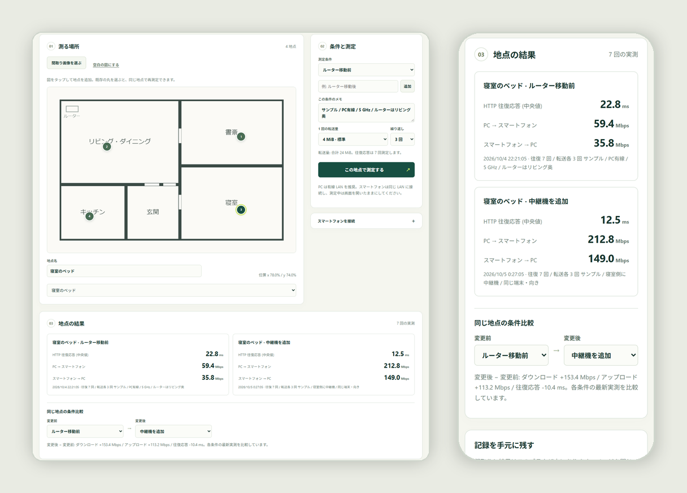

# RoomPing

[](https://github.com/anpanmanj987-hub/RoomPing/actions/workflows/ci.yml)
[](LICENSE)


**家の通信を、測った地点で比べる。**

「寝室だけ遅い気がする」「中継機を置いたら本当に速くなった？」を、間取りの上で確かめるためのツールです。PCで起動してスマホのブラウザでQRコードを読み取り、家の中を歩きながらその場所をタップすると、PC↔スマホ間の転送速度と応答時間を測って間取りに記録します。ルーターを動かす前と後など、条件を変えて同じ地点を測り直すと、差をその場で比べられます。

[English README](README.en.md)



<sub>画面は同梱のサンプル記録 [`docs/sample-roomping.json`](docs/sample-roomping.json) を読み込んだものです（実測値ではありません）。</sub>

## 特長

- **地点ごとに記録**：自宅の間取り画像（PNG/JPEG/WebP）か空白の図に、測った場所をそのまま残せます。
- **条件を変えて比較**：「ルーター移動前」「中継機を追加」などの条件ごとに同じ地点を測り、ダウンロード・アップロード・応答時間の差を表示します。
- **測った場所だけを表示**：測っていない場所を推測で塗るヒートマップは作りません。
- **スマホにアプリ不要**：ブラウザだけで動きます。PC側の依存パッケージは qrcode だけです。
- **日本語と英語に対応**：画面はブラウザの言語に合わせて切り替わります。右上のボタンでいつでも変更できます。
- **データは手元に**：間取りと結果はブラウザの中だけで扱い、JSON で保存・読み込みできます。CSV でも書き出せます。外部サービスには何も送りません。

## クイックスタート

Python 3.10 以上が必要です（Windows・macOS・Linux）。

```sh
python -m venv roomping-env
# Windows: roomping-env\Scripts\activate   macOS/Linux: source roomping-env/bin/activate
python -m pip install https://github.com/anpanmanj987-hub/RoomPing/archive/refs/tags/v0.1.0a4.zip
python -m roomping --host 0.0.0.0 --advertise 192.168.1.20
```

`192.168.1.20` は例です。PCのLAN内IPv4アドレス（Windowsは `ipconfig`、macOSは `ipconfig getifaddr en0`）に置き換えてください。表示された参加URLをPCのブラウザで開き、「スマートフォンを接続」のQRコードをスマホで読み取ります。終了は `Ctrl+C` です。

`--host` を省略すると `127.0.0.1` だけで待ち受けます（PC単体での動作確認用）。OSのファイアウォールで確認が出たら、プライベートネットワークだけで受信を許可してください。

まず画面を触ってみたいときは、参加URLを開いて「JSON を読み込む」から [`docs/sample-roomping.json`](docs/sample-roomping.json) を読み込んでください。

## 測り方

1. PCはできれば有線LANにつなぎます。
2. 間取り画像を選ぶか、空白の図を使います（5 MiB以下、最大1600万画素）。
3. スマホで今いる場所をタップして地点を追加し、名前を付けます。
4. 転送量（1 / 4 / 16 MiB）と繰り返し回数（1 / 3回）を選んで「この地点で測定する」を押します。測定中は画面を開いたままにしてください。
5. ルーターの位置などを変えたら、条件を追加して同じ地点の丸を選び、もう一度測ります。下の「同じ地点の条件比較」に差が表示されます。
6. ページを閉じる前に「JSON を保存」で記録を保存します。ブラウザは記録を自動では残しません。

既定では、HTTPの往復を7回、ダウンロードとアップロードを各4 MiB × 3回（合計24 MiB）測ります。速いLANでは16 MiBにすると比較が安定します。途中で画面を閉じたり通信に失敗したりした回は、記録しません。

**測っている値について**：ブラウザ・HTTP/TCP・PC・LANを通したアプリケーションの転送性能です。Wi-Fiの電波強度やリンク速度、インターネット回線の速度ではありません。「HTTP往復応答」はpingではなく、PCへのHTTPリクエストの往復時間です。比べるときは、端末・向き・PCの接続方法・周波数帯・ほかの通信をそろえ、メモに残してください。

## セキュリティとプライバシー

- 信頼できるLAN専用です。通信は暗号化されないHTTPなので、ポート転送やインターネットへの公開はしないでください。
- 参加URLには起動ごとの秘密トークンが含まれます。共有する相手に注意してください。再起動すると無効になります。
- Host・Originの検証、CORS非開放、リクエストのサイズ・時間・同時実行数の上限を設けています。測定は同時に1件だけ受け付けます。
- JSONの読み込みでは、形式・数値・ID・参照・座標・件数・画像の中身まで検証し、置き換える前に確認します。不正なファイルで今の記録が壊れることはありません。
- CSVは引用符と改行をエスケープし、数式として解釈される文字列を無害化します。

## 動作確認の状況

- **自動テスト**：Python 25件、JavaScript 31件。GitHub Actions で Python 3.10 / 3.12 / 3.14 と Node 24 で実行しています。
- **Windows**：2026年10月6日に、Windows 11 の Python 3.14.8・Node 24 で全テストが通ることと、Edge で実際に測定・条件追加・JSON読み込みができることを確認しました（PC単体のループバック接続）。
- **未確認**：実際のスマートフォンとWi-Fiでの測定、モバイルブラウザごとの違い、JSON/CSVの保存ダイアログ。

詳しくは [検証記録](docs/VALIDATION.md) と [設計メモ](docs/DESIGN.md) を参照してください。

## 開発

```sh
git clone https://github.com/anpanmanj987-hub/RoomPing.git
cd RoomPing
python -m pip install -e .
python -m unittest discover -s tests -v
node --test tests/*.test.mjs
```

JavaScriptのテストには Node.js 22 以上を推奨します。不具合の報告や改善の提案は [Issues](https://github.com/anpanmanj987-hub/RoomPing/issues) へお願いします。変更履歴は [CHANGELOG](CHANGELOG.md) にあります。

## ライセンス

[MIT](LICENSE)
